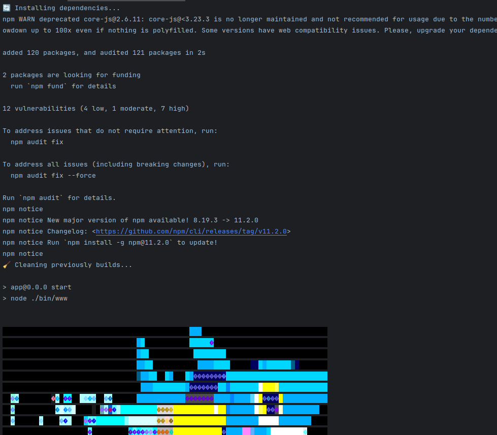
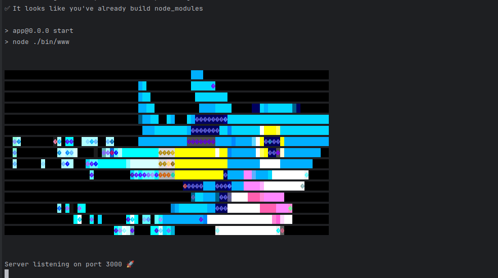

## 💻What's is it?

It's an example about how to optimize a deployment for a node app just controlling when a `npm ci` must be done using a checksum & a volume.

This trick can be used to accelerate any application with a third package version system based on lock files.

## ⚙️How it works?

Basically it works using a volume and a checksum validation over the .lock file (this file tells us exactly which version is being used for each vendor package), so if this file changes it means we have to rebuild our application

In this scenario we just use a named volume attached to the container but it can be replicated in the same way for Cloud Services like EC2 instances and EBS volumes or similar.

## 🚀 Usage

Just follow these steps:

1. Clone the repo and move to `docker/` dir
2. `make build-dev`

### Test it

Execute:

1. `make bring-up` to raise the app container
2. `docker logs -f app`  and you will see something like:
   
3. `make bring-down && make bring-up` to restart the container
4. `docker logs -f app` you will see something like:
   
5. As you can see, the app ignored to rebuild node packages because there is nothing to rebuild!

### More testing

You can test the previous explained flow altering the app in the following way:

- It never re-build the node_modules directory when:

  - Deleting **node_modules** directory (not if first time), it will only refresh it copy & pasting from the named volume
  - Adding new files or removing it from node_modules directory, same as previously point

- It will always rebuild the node_modules directory when:

  - If the volume is empty or the checksum directory does not exist

  - A new change is detected at the package-lock.json (try adding, removing or updating packages)

    - `docker exec -it app npm install dotenv` (install a new package) note that in this case there is no execution of the entrypoint.sh so you have to restart the container once to allow the app to cache checksum's directory

  - The package-lock.json is deleted

