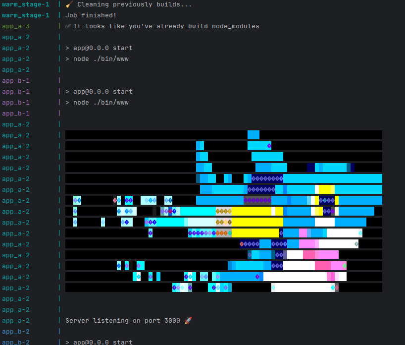

## 💻What's is it?

It's an example about how to optimize a deployment for a node app just controlling when a `npm ci` must be done using a checksum & a volume.

This trick can be used to speed up any application deployment with a third package version system based on lock files.

## ⚙️How it works?

Basically it works using a volume and a checksum validation over the .lock file (this file tells us exactly which version is being used for each vendor package), so if this file changes it means we have to rebuild our application.

In this scenario we just use a named volume attached to the container but it can be replicated in the same way for Cloud Services like EC2 instances and EBS volumes or similar.

I've added two examples, one simpled using 1 app and another one more complex when we have an horizontal escalability

## 🚀 Simple app usage

Just follow these steps:

1. Clone the repo and move to `docker/` dir
2. `make build-app`

### Test it

Execute:

1. `make bring-up-app` to raise the app container
2. `make app-logs`  and you will see something like:
   
3. `make bring-down-app && make bring-up-app` to restart the container
4. `make app-logs` you will see something like:
   
5. As you can see, the app ignored to rebuild node packages because there is nothing to rebuild!

### More testing

You can test the previous explained flow altering the app in the following way:

- It never re-build the node_modules directory when:

    - Deleting **node_modules** directory (not if first time), it will only refresh it copy & pasting from the named volume
    - Adding new files or removing it from node_modules directory, same as previously point

- It will always rebuild the node_modules directory when:

    - If the volume is empty or the checksum directory does not exist

    - A new change is detected at the package-lock.json (try adding, removing or updating packages)

        - `docker exec -it {container} npm install dotenv` (install a new package) note that in this case there is no execution of the entrypoint.sh so you have to restart the container once to allow the app to cache checksum's directory

    - The package-lock.json is deleted

## 🎮Scalable usage

This is very similar to the simple one. In this case, we use the **`warm_stage`** service to check and delegate the responsibility of rebuilding the `node_modules` directory in order to raise 3 app (app_a) and 2 (app_b) replicas with specific configuration on each of them.

> [!NOTE]
>
> If you take a look to the Dockerfile **build-scalable** stage, you will notice we are packing the app inside the container, so, **ensure your node_modules directory does not exists or will be copied in the process altering the results**

So, you just need to build the app image with `make build-scalable` and then execute and play with these recipes:

- `make bring-down-scalable`
- `make bring-up-scalable`
- `make scalable-logs`

Example after building and bringing up the scalable context:

